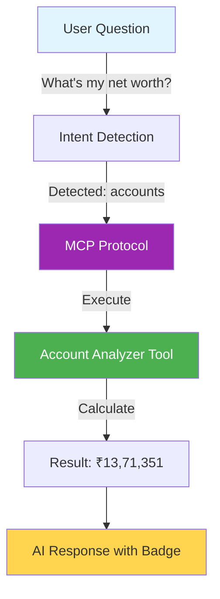
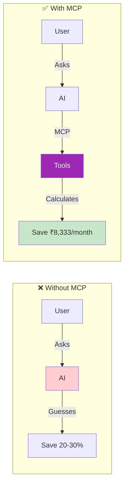
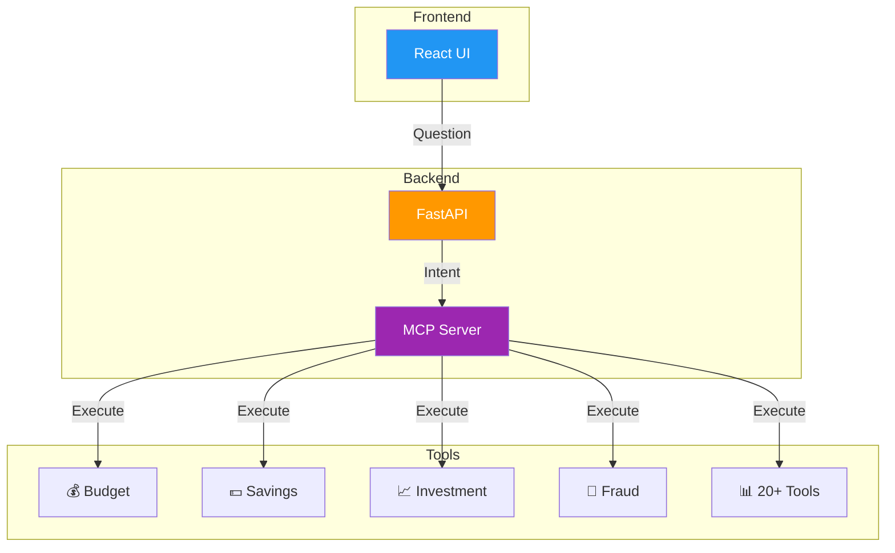
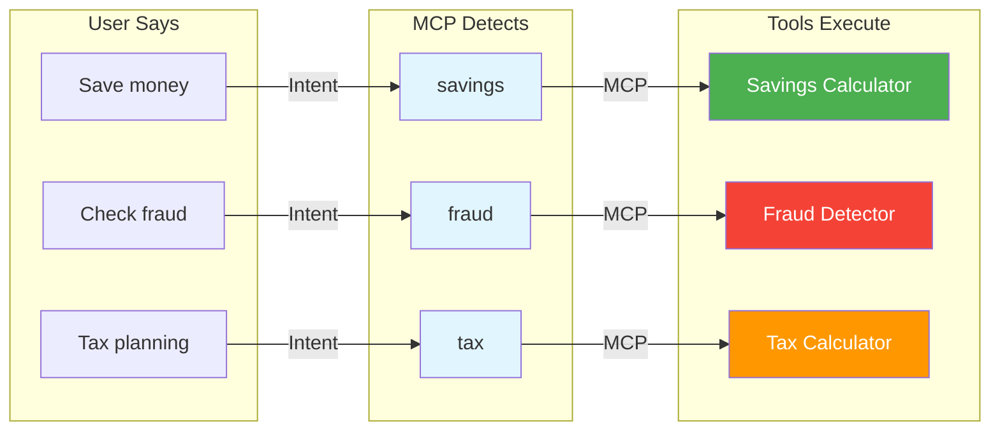
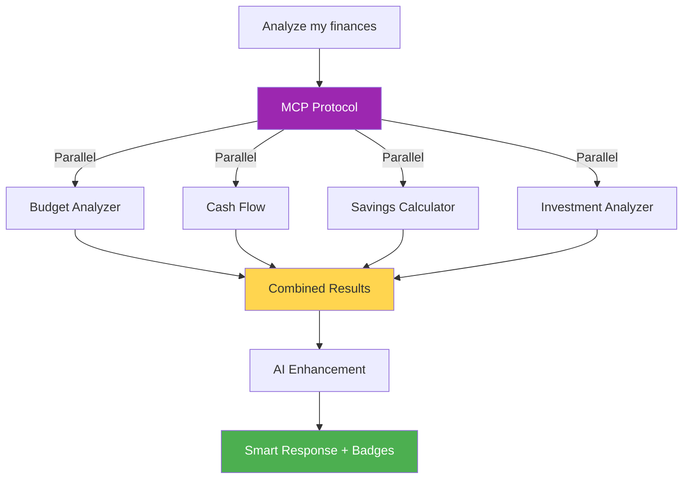
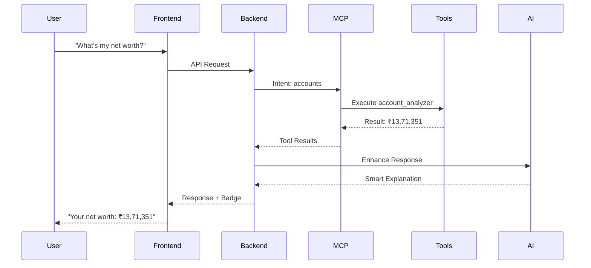
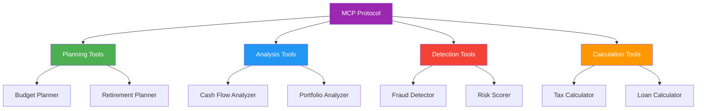
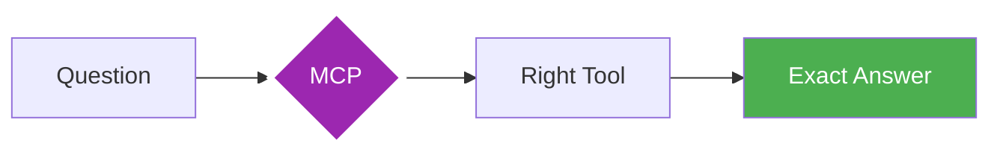
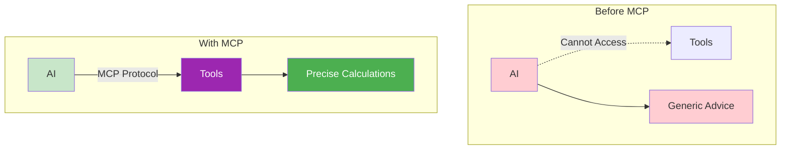
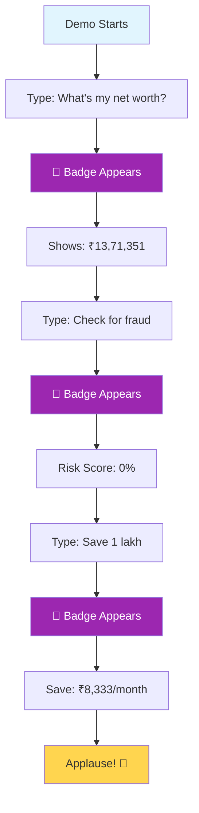

# 🎨 MCP Mermaid Diagrams - Simple & Clean

## 1️⃣ Basic MCP Flow (Simplest)



## 2️⃣ MCP vs Traditional AI



## 3️⃣ Complete System Architecture



## 4️⃣ Intent to Tool Mapping



## 5️⃣ Multi-Tool Execution



## 6️⃣ Real-Time Data Flow



## 7️⃣ Tool Categories



## 8️⃣ The MCP Magic (Simplest Explanation)



## 9️⃣ Why MCP is Revolutionary



## 🔟 Live Demo Flow



---

## 📝 How to Use These Diagrams

### For Slides:
1. Copy the mermaid code
2. Paste in any Markdown editor that supports Mermaid
3. Or use mermaid.live to generate images

### For Live Presentation:
- Use diagrams 1, 2, and 8 (simplest)
- Show diagram 5 for multi-tool magic
- End with diagram 9 (revolutionary impact)

### Color Legend:
- 🟣 Purple: MCP Protocol
- 🟢 Green: Success/Tools
- 🔵 Blue: Frontend/UI
- 🟠 Orange: Backend/API
- 🟡 Yellow: Results
- 🔴 Red: Problems/Detection

---

## 🎯 The One Diagram to Rule Them All

If you can only show ONE diagram, use this:

```mermaid
graph LR
    User[User: "Help me save money"] --> MCP{MCP Magic}
    MCP --> Tools[20+ Financial Tools]
    Tools --> Answer[Exact Answer: "Save ₹8,333/month"]

    style MCP fill:#9c27b0,color:#fff,stroke:#fff,stroke-width:4px
    style Tools fill:#4caf50,color:#fff
    style Answer fill:#ffd54f,stroke:#333,stroke-width:2px
```

Simple. Clear. Revolutionary! 🚀